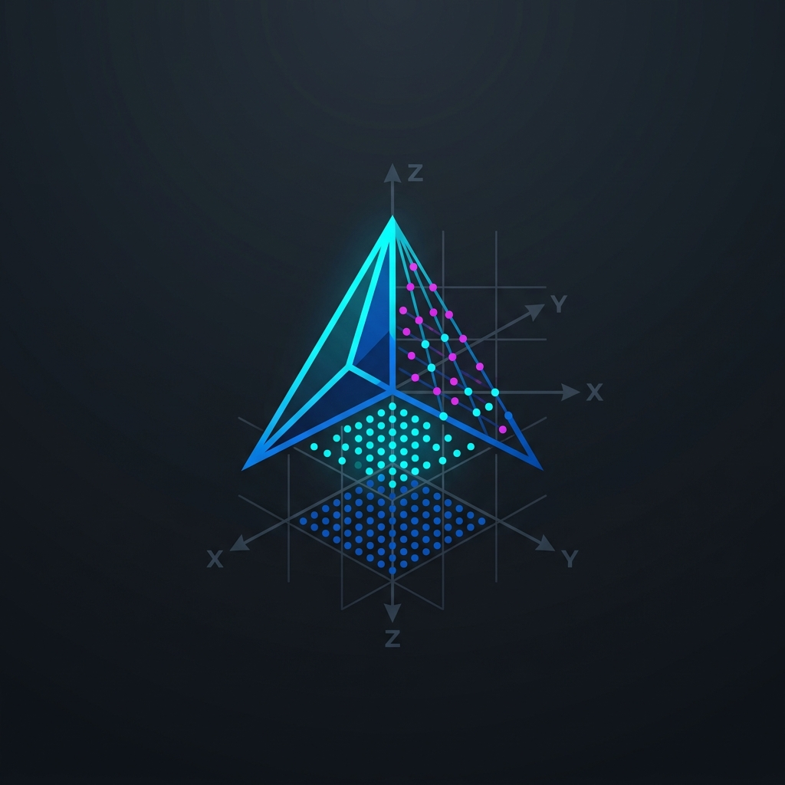
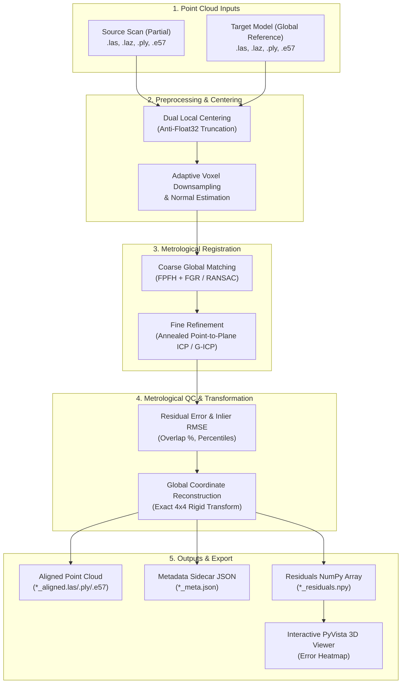

# PARTiaL2GLOBAL

<div align="center">


<br><br>

[](https://www.python.org/)
[](http://www.open3d.org/)
[](https://docs.pyvista.org/)
[](https://www.riverbankcomputing.com/software/pyqt/)
[](https://opensource.org/licenses/MIT)
[]()

**Lightweight, High-Precision Partial-to-Global Point Cloud Registration Suite**  
*Metrological alignment of small partial scans onto large global reference models with Python API, CLI, and modern PyQt5 GUI.*

[Features](#-key-features) • [Installation](#-installation) • [Quickstart](#-quickstart) • [Architecture](#-architecture) • [Python API](#-python-api) • [CLI](#-command-line-interface-cli) • [GUI](#-desktop-gui) • [License](#-license)

</div>

---

## 🎯 Motivation: The Partial-to-Global Challenge

Aligning a **small, local scan** (e.g., an equipment room, a single industrial apparatus, a drone patch, or an updated section) into a **large global reference model** (e.g., an entire plant, facility digital twin, or site survey of 50M–500M points) is fundamentally different from registering two overlapping scans of comparable size:

1. **Massive Scale & Density Asymmetry**: The target reference is orders of magnitude larger than the source. Loading and computing dense descriptors across the entire target exhausts system memory.
2. **Low Overlap Ratio (5% – 25%)**: Standard global matching algorithms (naive RANSAC) struggle because the majority of target features have no counterpart in the source.
3. **Cartographic Coordinate Jitter (UTM / Georeferenced)**: Coordinates with millions of meters cause numerical truncation errors in 32-bit GPU and C++ KD-Tree calculations.
4. **Metadata & Sensor Pose Integrity**: Industrial formats like **E57** contain embedded $360^\circ$ spherical camera panoramas (`images2D`), sensor position vectors, and intensity channels that must undergo rigid rototranslation without file corruption.

**PARTiaL2GLOBAL** solves these problems with a decoupled, lightweight metrology engine that achieves **millimeter-level accuracy** without external database or enterprise server dependencies.

---

## 🌟 Key Features

- **⚡ Dual Local Centering**: Automatically neutralizes float32 precision loss by registering in local centroid-relative space and mathematically reconstructing the exact global $4 \times 4$ transformation matrix.
- **🌊 Streaming Memory-Safe Target Ingestion**: Progressively downsamples multi-gigabyte target clouds (E57, LAS/LAZ, PLY) on-the-fly to keep memory usage bounded.
- **🔄 Two-Stage Metrological Registration**:
  - *Coarse Alignment*: Fast Point Feature Histograms (FPFH) coupled with **Fast Global Registration (FGR)** or stochastic **RANSAC** with mutual correspondence checking.
  - *Fine Refinement*: **Point-to-Plane ICP** or **Generalized ICP (G-ICP)** powered by **Multi-Scale Gradual Annealing** ($3.0\times \to 1.5\times \to 1.0\times$ voxel threshold) to avoid local minima.
- **📊 Metrological Quality Control (QC Gate)**:
  - Multi-threaded C++ KD-Tree distance calculations.
  - Overlap ratio calculation (%) based on adaptive thresholding.
  - Inlier Root Mean Square Error (RMSE) and percentile error distribution ($\text{Q}_{25}$, Median, $\text{Q}_{75}$, $\text{Q}_{95}$, Max).
  - Standardized JSON provenance sidecar (`*_meta.json`).
- **📸 360° Spherical Panoramas Preservation (E57)**: Accurately rototranslates camera station translation vectors and orientation quaternions within E57 files.
- **🖥️ Modern PyQt5 Desktop GUI**: Intuitive card-based interface with automatic voxel estimation, real-time logging, live KPI metric badges, and matrix export.
- **👁️ 3D Residual Error Inspection (PyVista)**: Interactive 3D visualization featuring continuous Turbo colormap heatmaps mapped directly onto points.

---

## 🏗️ Architecture



---

## 📦 Installation

### Option 1: Conda Environment (Recommended)

```bash
# Create and activate environment
conda create -n partial2global python=3.10 -y
conda activate partial2global

# Install core dependencies
pip install -r requirements.txt
```

### Option 2: Pip Install from Source

```bash
git clone https://github.com/ndree97/PARTiaL2GLOBAL.git
cd PARTiaL2GLOBAL
pip install -e .
```

---

## 🚀 Quickstart

### 🖥️ Desktop GUI

Launch the standalone modern graphical application:

```bash
python main.py
# or if installed via pip:
partial2global-gui
# or shortcut:
p2g-gui
```

1. Select your **Source** (partial scan) and **Target** (global reference).
2. Click **⚡ Auto-Calcola** to estimate the optimal voxel size from the source bounding box.
3. Select your desired algorithms (e.g., `FGR` + `Point-to-Plane ICP` with `Gradual Annealing`).
4. Click **▶ Avvia Allineamento Metrologico**.
5. Inspect metrics in real-time and click **👁 Ispeziona nel 3D** to view the residual heatmap.

---

### 💻 Command Line Interface (CLI)

Run automated batch registrations headlessly or via terminal:

```bash
python cli.py -s tests/data/room_scan.laz -t tests/data/master_facility.e57 --coarse fgr --fine point_to_plane --visualize
# or if installed via pip:
p2g -s room_scan.laz -t master_facility.e57 --visualize
```

#### CLI Options

| Flag | Type | Default | Description |
| :--- | :--- | :--- | :--- |
| `-s, --source` | `str` | *Required* | Path to partial source point cloud (`.las`, `.laz`, `.ply`, `.e57`) |
| `-t, --target` | `str` | *Required* | Path to global target reference model |
| `-v, --voxel-size` | `float` | `Auto` | Voxel downsampling size in meters (auto-estimated if omitted) |
| `-o, --out-dir` | `str` | `<src_dir>/*_out` | Custom output directory |
| `--coarse` | `str` | `fgr` | Coarse algorithm: `fgr` (Fast Global Registration) or `ransac` |
| `--fine` | `str` | `point_to_plane` | Fine refinement algorithm: `point_to_plane` ICP or `generalized` (G-ICP) |
| `--no-anneal` | `flag` | `False` | Disable multi-scale gradual annealing |
| `--ransac-max-iter`| `int` | `4000000` | Maximum iterations for RANSAC |
| `--visualize` | `flag` | `False` | Open interactive PyVista 3D residual heatmap upon completion |

---

### 🐍 Python API

Integrate PARTiaL2GLOBAL into your custom Python processing pipelines in 3 lines of code:

```python
from partial2global import Partial2GlobalAligner

# 1. Initialize aligner with metrological settings
aligner = Partial2GlobalAligner(
    coarse="fgr",
    fine="point_to_plane",
    anneal=True
)

# 2. Run partial-to-global registration
result = aligner.align(
    source="data/pump_skid.laz",
    target="data/refinery_master.e57",
    out_dir="./output"
)

# 3. Access quality metrics and transformation matrix
print(f"Overlap: {result.overlap_pct:.2f}%")
print(f"Inlier RMSE: {result.inlier_rmse * 1000:.2f} mm")
print(f"4x4 Matrix:\n{result.transformation_matrix}")
print(f"Aligned file saved at: {result.aligned_cloud_path}")
```

---

## 📑 Provenance Metadata Sidecar (`*_meta.json`)

Every registration run generates a comprehensive JSON sidecar alongside the aligned cloud, ensuring full traceability for metrological validation:

```json
{
    "generator": "PARTiaL2GLOBAL v1.0.0",
    "timestamp": "2026-09-29 17:03:00",
    "configuration": {
        "source_path": "C:/data/source.laz",
        "target_path": "C:/data/target.e57",
        "voxel_size": 0.05,
        "coarse_method": "fgr",
        "fine_method": "point_to_plane",
        "annealing": true,
        "execution_time_seconds": 12.45
    },
    "quality_metrics": {
        "total_source_points": 2450120,
        "inliers_count": 2315600,
        "overlap_pct": 94.51,
        "overlap_threshold": 0.10,
        "inlier_rmse": 0.002841,
        "min_error": 0.000008,
        "median_error": 0.001950,
        "mean_error": 0.002410,
        "max_error": 0.098200
    },
    "transformation": {
        "matrix_4x4": [
            [0.984807, -0.173648, 0.0, 500124.521],
            [0.173648,  0.984807, 0.0, 4500341.118],
            [0.0,       0.0,      1.0, 154.210],
            [0.0,       0.0,      0.0, 1.0]
        ],
        "euler_angles_deg": {
            "roll": 0.0,
            "pitch": 0.0,
            "yaw": 10.0
        }
    }
}
```

---

## 🧪 Testing and Verification

Run the automated test suite with synthetic partial-to-global verification in cartographic coordinates:

```bash
python tests/test_registration.py
```

Expected output:
```text
==================================================
 Running PARTiaL2GLOBAL Test Suite
==================================================
[1/4] Testing transforms decomposition...
      [OK] PASSED
[2/4] Testing dual centering reconstruction...
      [OK] PASSED
[3/4] Testing synthetic partial-to-global registration...
      [OK] PASSED (Inlier RMSE: 0.0013 m, 100% Overlap)
[4/4] Testing fast bounds & on-demand saving (no auto-save)...
      [OK] PASSED
==================================================
 ALL TESTS PASSED SUCCESSFULLY!
==================================================
```

---

## 📂 Repository Structure

```text
PARTiaL2GLOBAL/
├── .gitignore                      # Clean Python, IDE, and point cloud exclusions
├── LICENSE                         # MIT License
├── pyproject.toml                  # Modern PEP 517/518 build metadata & CLI entry points
├── requirements.txt                # Pinned dependency requirements
├── README.md                       # Comprehensive documentation
├── main.py                         # Unified entry point (launches GUI or routes to CLI)
├── cli.py                          # Dedicated CLI entry point
├── partial2global/
│   ├── __init__.py                 # Top-level API exports
│   ├── core/
│   │   ├── transforms.py           # 4x4 matrix decomposition & Dual Local Centering
│   │   └── bounding_box.py         # Fast header bounds, AABB/OBB & adaptive voxel heuristics
│   ├── io/
│   │   ├── point_cloud_io.py       # LAS/LAZ/PLY/E57 loader with streaming target reader
│   │   └── e57_handler.py          # E57 handler & 360° spherical panoramas rototranslation
│   ├── registration/
│   │   ├── coarse.py               # FPFH extraction, FGR, and RANSAC
│   │   ├── fine.py                 # Point-to-Plane ICP & G-ICP with Gradual Annealing
│   │   └── pipeline.py             # Orchestrator & Partial2GlobalAligner API
│   ├── metrics/
│   │   └── quality.py              # Inlier RMSE, Overlap %, and JSON sidecar generation
│   ├── visualization/
│   │   ├── clipping.py             # Interactive 6-face GPU clipping box manager
│   │   └── visualizer.py           # PyVista 3D inspection with residual error heatmap
│   └── gui/
│       ├── styles.py               # Modern high-contrast QSS theme
│       ├── workers.py              # Non-blocking background QThread worker
│       ├── resources/logo.png      # Official application branding logo
│       └── app_window.py           # Dedicated PyQt5 desktop application
└── tests/
    ├── conftest.py
    └── test_registration.py        # Unit tests & synthetic ground-truth validation
```

---

## 📄 License

This project is licensed under the **MIT License** — see the [LICENSE](LICENSE) file for details. Free for academic, personal, and commercial use.
